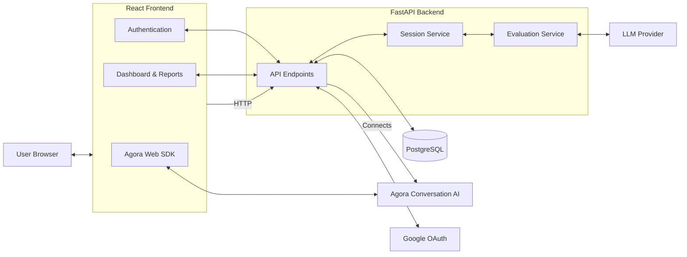
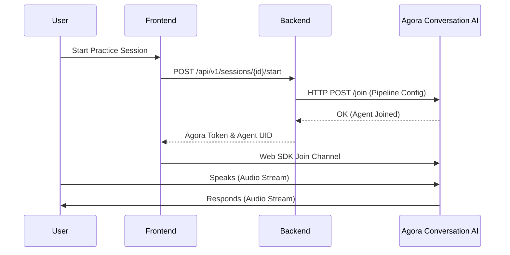
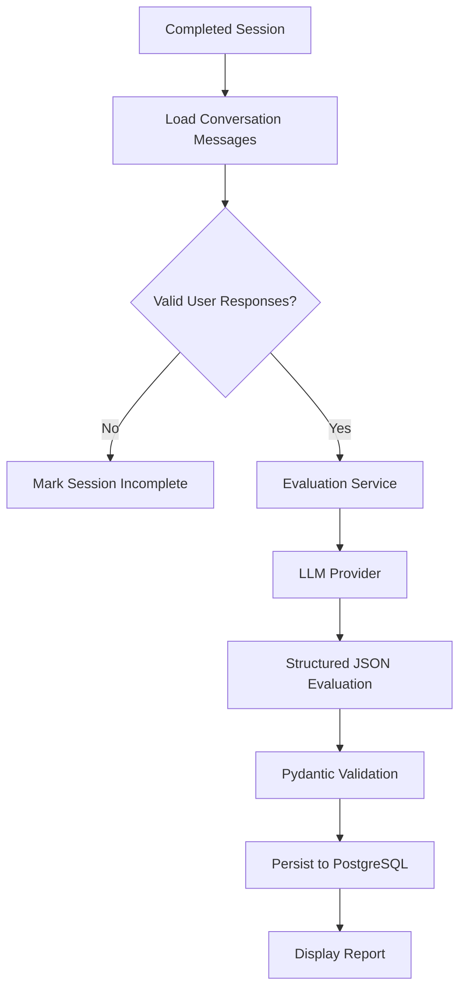
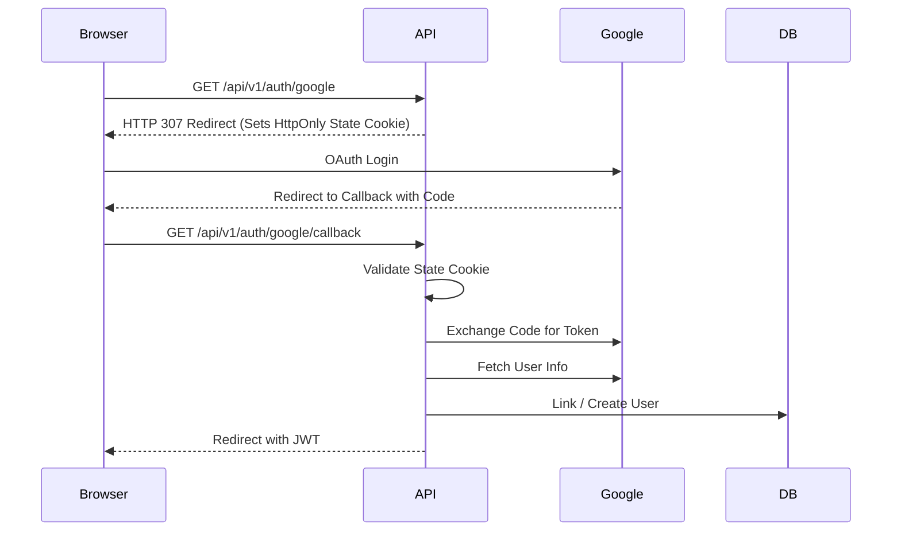

# VoxMentor System Architecture

This document describes the high-level architecture and subsystem components of VoxMentor.

## 1. High-Level System Architecture

## 2. Real-Time Voice Flow (Live Path)

## 3. Post-Session Evaluation Flow

## 4. Authentication Flow

VoxMentor utilizes a dual-authentication architecture supporting both traditional Email/Password and Google OAuth 2.0.

## 5. Security Boundaries

- **Frontend**: Contains no secrets. `VITE_` variables are public.
- **Backend**: Holds the `DATABASE_URL`, `JWT_SECRET`, `GOOGLE_CLIENT_SECRET`, `AI_API_KEY`, and `AGORA_APP_CERTIFICATE`.
- **Database**: Stores hashed passwords (`bcrypt`).
