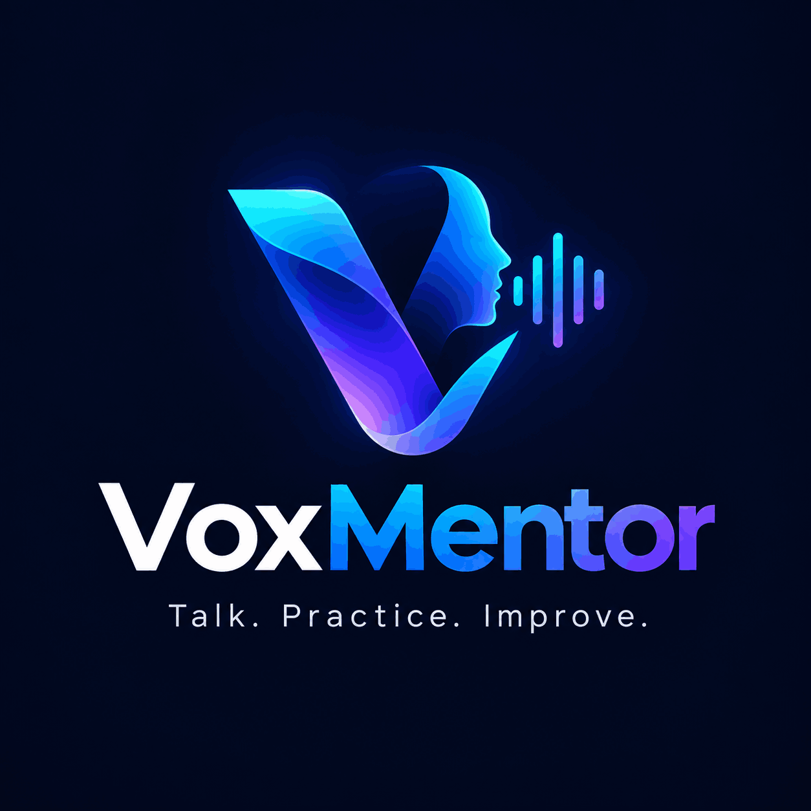
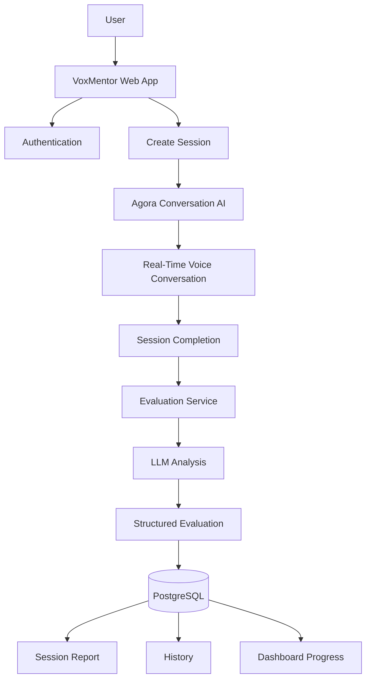
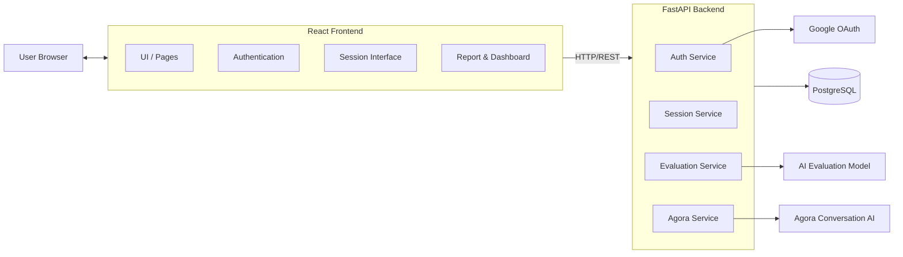

<p align="center">
  
</p>

<h1 align="center">VoxMentor</h1>

<p align="center">
  <strong>Talk. Practice. Improve.</strong><br>
  A Real-Time AI Career Mentor for Interviews, Learning & Professional Communication.
</p>

<p align="center">
  
  
  
  
  
  
</p>

---

## Overview

VoxMentor is a **real-time conversational AI platform** that helps students and job seekers master their communication and interview skills through natural voice interaction.

Traditional interview prep is text-heavy, static, and provides limited feedback. VoxMentor solves this by placing users in dynamic, real-time **voice conversations** with an adaptive AI agent — one that listens, adapts follow-up questions, and generates structured post-session evaluations to track progress over time.

> **Core technology**: Agora Conversation AI powers the real-time voice interaction layer.

---

## Key Features

- **Real-Time AI Voice Conversation** — Ultra-low latency voice sessions via Agora Conversation AI
- **4 Specialized Practice Modes** — Technical Interview, HR Interview, Learning Mentor, Communication Coach
- **Adaptive Questioning** — The AI adapts based on user responses and topic difficulty
- **Post-Session AI Evaluation** — LLM-powered structured scoring with strengths, weaknesses, and recommendations
- **Session Dashboard** — Persistent history, average scores, and progress tracking
- **Dual Authentication** — Email/Password and Google OAuth 2.0 with secure JWT sessions
- **Premium UI** — Dark-themed Tailwind CSS design with a Three.js/Fiber 3D hero, Framer Motion animations, and an animated footer

---

## Why VoxMentor?

| Traditional Prep | VoxMentor |
| :--- | :--- |
| Static list of questions | Dynamic, real-time voice conversation |
| Text-heavy, passive reading | Natural speaking and listening |
| No conversational adaptation | Adaptive AI follow-up questions |
| Manual self-assessment | Automated structured post-session evaluation |
| No progress tracking | Persistent session history and score trends |

---

## Practice Modes

| Mode | Purpose | Examples |
|------|---------|---------|
| **Technical Interview** | Technical interview practice | Programming, CS fundamentals, system design |
| **HR Interview** | Behavioral interview practice | Situational and behavioral questions |
| **Learning Mentor** | Concept understanding | Explanations, comprehension checks |
| **Communication Coach** | Professional speaking | Clarity, fluency, confidence, vocabulary |

---

## How It Works



---

## System Architecture



For detailed architecture with sequence diagrams, see [ARCHITECTURE.md](ARCHITECTURE.md).

---

## Tech Stack

| Domain | Technologies |
| :--- | :--- |
| **Frontend** | React 19, TypeScript, Vite, Tailwind CSS v4, React Router v7, TanStack Query v5, Agora Web SDK, Recharts, Three.js, React Three Fiber, Framer Motion |
| **Backend** | Python 3.13, FastAPI, Pydantic, SQLAlchemy, PostgreSQL, Alembic, JWT (python-jose), bcrypt, HTTPX, pytest |
| **AI / Voice** | Agora Conversation AI (Pipeline-based) |
| **Auth** | JWT, Google OAuth 2.0 |

---

## Project Structure

```text
VOXMENTOR/
├── frontend/
│   ├── src/
│   │   ├── components/ui/      # Reusable UI components
│   │   ├── pages/              # Route-level pages
│   │   ├── services/           # API client & Agora RTC service
│   │   ├── stores/             # Auth context
│   │   └── layouts/            # App shell layout
│   ├── public/                 # Static assets (logo.png, favicon)
│   ├── package.json
│   └── .env.example
│
├── backend/
│   ├── app/
│   │   ├── api/routes/         # FastAPI route handlers
│   │   ├── core/               # Config, security, logging
│   │   ├── db/                 # Database session
│   │   ├── models/             # SQLAlchemy ORM models
│   │   ├── schemas/            # Pydantic schemas
│   │   └── services/           # Agora & Evaluation services
│   ├── alembic/                # Database migrations
│   ├── tests/                  # pytest test suite
│   ├── requirements.txt
│   ├── Dockerfile
│   └── .env.example
│
├── docs/                       # Extended documentation
├── ARCHITECTURE.md
├── BUILDING.md
├── CHANGELOG.md
├── CONTRIBUTING.md
├── LICENSE
├── README.md
├── ROADMAP.md
├── SECURITY.md
└── SETUP.md
```

---

## API Endpoints

| Method | Endpoint | Description |
|--------|----------|-------------|
| `POST` | `/api/v1/auth/register` | Register a new user |
| `POST` | `/api/v1/auth/login` | Login with email/password |
| `GET` | `/api/v1/auth/me` | Get current user |
| `GET` | `/api/v1/auth/google` | Initiate Google OAuth flow |
| `GET` | `/api/v1/auth/google/callback` | Google OAuth callback |
| `POST` | `/api/v1/sessions` | Create a new practice session |
| `GET` | `/api/v1/sessions` | List user sessions |
| `GET` | `/api/v1/sessions/{id}` | Get session details |
| `POST` | `/api/v1/sessions/{id}/start` | Start session (joins Agora agent) |
| `POST` | `/api/v1/sessions/{id}/end` | End session (triggers evaluation) |
| `GET` | `/api/v1/sessions/{id}/evaluation` | Get session evaluation |
| `GET` | `/api/v1/dashboard/summary` | Get dashboard summary |
| `GET` | `/api/v1/health` | Health check |

---

## Local Development

See [SETUP.md](SETUP.md) for full setup instructions.

**Backend:**
```powershell
cd backend
.\venv\Scripts\activate
pip install -r requirements.txt
alembic upgrade head
uvicorn app.main:app --reload
```

**Frontend:**
```powershell
cd frontend
npm install
npm run dev
```

| Service | URL |
|---------|-----|
| Frontend | http://localhost:5173 |
| Backend API | http://localhost:8000 |
| Swagger Docs | http://localhost:8000/docs |
| Health Check | http://localhost:8000/api/v1/health |

> Copy `backend/.env.example` → `backend/.env` and `frontend/.env.example` → `frontend/.env` and fill in your credentials.

---

## Testing

**Backend (34 tests):**
```powershell
cd backend
.\venv\Scripts\python.exe -m pytest -v
```

**Frontend build validation:**
```powershell
cd frontend
npm run build
```

---

## Security

- Passwords hashed with `bcrypt` via `passlib`
- JWT sessions with expiry enforcement
- Google OAuth CSRF protection via HttpOnly state cookie
- SQLAlchemy ORM for parameterized queries (SQL injection prevention)
- Strict separation of frontend public vars (`VITE_`) and backend secrets

See [SECURITY.md](SECURITY.md) for full details.

---

## Roadmap

See [ROADMAP.md](ROADMAP.md) for completed milestones and future plans.

---

## Contributing

See [CONTRIBUTING.md](CONTRIBUTING.md) for guidelines.

---

## Hackathon / Project Context

VoxMentor was built as a **voice-first AI project** using the **Agora Conversation AI** platform as its core voice infrastructure. Agora provides the real-time RTC transport and conversational AI agent bindings that enable the ultra-low latency voice interaction at the heart of this product.

---

## Status

**Current Status: Feature-Complete — Pre-Deployment Ready**

The application has passed end-to-end QA with 34/34 backend tests passing and a clean frontend production build.

---

## License

MIT License — see [LICENSE](LICENSE) for details.